# Web-App-DevOps-Project

Welcome to the Web App DevOps Project repo! This application allows you to efficiently manage and track orders for a potential business. It provides an intuitive user interface for viewing existing orders and adding new ones.

## Table of Contents

- [Features](#features)
- [Getting Started](#getting-started)
- [Technology Stack](#technology-stack)
- [Contributors](#contributors)
- [License](#license)

## Features

- **Order List:** View a comprehensive list of orders including details like date UUID, user ID, card number, store code, product code, product quantity, order date, and shipping date.
  


- **Pagination:** Easily navigate through multiple pages of orders using the built-in pagination feature.
  


- **Add New Order:** Fill out a user-friendly form to add new orders to the system with necessary information.
  


- **Data Validation:** Ensure data accuracy and completeness with required fields, date restrictions, and card number validation.

## Getting Started

### Prerequisites

For the application to succesfully run, you need to install the following packages:

- flask (version 2.2.2)
- pyodbc (version 4.0.39)
- SQLAlchemy (version 2.0.21)
- werkzeug (version 2.2.3)

### Usage

To run the application, you simply need to run the `app.py` script in this repository. Once the application starts you should be able to access it locally at `http://127.0.0.1:5000`. Here you will be meet with the following two pages:

1. **Order List Page:** Navigate to the "Order List" page to view all existing orders. Use the pagination controls to navigate between pages.

2. **Add New Order Page:** Click on the "Add New Order" tab to access the order form. Complete all required fields and ensure that your entries meet the specified criteria.

## Technology Stack

- **Backend:** Flask is used to build the backend of the application, handling routing, data processing, and interactions with the database.

- **Frontend:** The user interface is designed using HTML, CSS, and JavaScript to ensure a smooth and intuitive user experience.

- **Database:** The application employs an Azure SQL Database as its database system to store order-related data.

- **Docker:** The application uses docker to containerise the app and host the image on docker hub

## Containerising the app
Prerequisites
----
You should have Docker Engine and Docker CLI installed

Steps to build a docker image of the application
1. Clone the repo
```
git clone git@github.com:junior451/Web-App-DevOps-Project.git
```

2. Build the image
```
cd Web-App-DevOps-Project
docker build -t devops-orders-project
```

3. Run the following command to build the docker image
```
docker run -p 5000:5000 devops-orders-project
access it at https://localhost:5000
```

4. Tag the image and push it to dockerhub
```
docker tag devops-orders-project <docker-hub-username/devops-orders-project>:latest
```

5. You can also pull the image from dockerhub without building if its already been pushed to dockerhub

```
docker pull junior451/devops-orders-project:latest
docker run -p 5000:5000 junior451/devops-orders-project
```

## Cleanup

### Remove containers
```
docker ps -a
docker rm container-id
```

**Remove images**

```
docker images -a
docker rmi image-id
```

## Provisioning an AKS cluster with Terraform
Prerequisites
----
You should have Terraform installed
- Click on this [link](https://developer.hashicorp.com/terraform/tutorials/aws-get-started/install-cli) to install terraform on your operating system

- Check that the correct version was installed
```
terraform -v
```

### Steps to provisioning the networking component of the aks-cluster
1. create the directory and terraform files
```
  mkdir aks-terraform

  cd aks-terraform

  mkdir networking-module

  cd networking-module

  touch main.tf outputs.tf variables.tf
```

2. Define the variables to be used to provision the resources in variales.tf
- **resource_group_name**: this will have the default name  for the network resource group which will be used in the resource group
- **location**: this will specify the name of the location where the resources will be provisioned
- **vnet_address_space**: this will soecify the address space for the virtual network where the network resources will be placed

3. Define the following resources to be provisioned on azure in main.tf
- **Azure Resource Group**: This will contain the networking resources
- **Virtual Network(VNET)**: This is the vnet for the aks cluster
- **Control Plane Subnet**: This subnet will host the control plane components of the aks cluster
- **Worker Node Subnet**: This will be the network space for hosting the workder nodes of the cluster

4. Define the output variables which will be accessed later on outside the network module in outputs.tf
- **vnet_id**: This will store the ID of the previously created VNet. This will be used within the cluster module to connect the cluster to the defined VNet. 
- **control_plane_subnet_id**: This will store the ID of the control plane subnet within the VNet. This will be used to specify the subnet where the control plane components of the AKS cluster will be deployed to.
- **worker_node_subnet_id**: This will store the ID of the worker node subnet within the VNet. This will be used to specify the subnet where the worker nodes of the AKS cluster will be deployed to.
- **networking_resource_group_name**:  This will provide the name of the Azure Resource Group where the networking resources were provisioned in. This will be used to ensure the cluster module resources are provisioned within the same resource group.
- **aks_nsg_id**: This will store the ID of the Network Security Group (NSG). This will be used to associate the NSG with the AKS cluster to specify inbound and outboud traffic rules

5. Initialise the network module
    ```
    cd networking-module
    terraform init
    ```

### Steps to provisioning the worker nodes component of the aks-cluster
1. create the directory and terraform files: inside the aks-terraform directory

```
  mkdir aks-cluster-module

  cd aks-cluster-module

  touch main.tf outputs.tf variables.tf
```

2. Define the variables to be used to provision the resources in variables.tf
- **aks_cluster_name**: The name of the AKS cluster
- **cluster_location**: The Azure region where the AKS cluster will be deployed
- **dns_prefix**: This defines the DNS prefix of cluster
- **kubernetes_version**: This defines Kubernetes version the cluster will use
- **service_principal_client_id**: This provides the Client ID for the service principal associated with the cluster
- **service_principal_secret**: This provides the Client Secret for the service principal
- **resource_group_name**: this will soecify the address space for the virtual network where the network resources will be placed
- **vnet_id**: this will soecify the address space for the virtual network where the network resources will be placed
- **control_plane_subnet_id**: this will specify the address space for the virtual network where the network resources will be placed
- **worker_node_subnet_id**: this will soecify the address space for the virtual network where the network resources will be placed


3. Define the following resources to be provisioned on azure in main.tf
- **azurerm_kubernetes_cluster**: This will provision the kubernetes cluster on azure. Within the resource, the default_node_pool and service_principal is also defined

4. Define the output variables which will be accessed later on outside the network module in outputs.tf
- **aks_cluster_name**: This will store the name of the provisioned cluster
- **aks_cluster_id**: This will store the ID of the cluster
- **aks_kubeconfig**: This will store the kubernetes configuration file of the cluster. This file is essential for interacting with and managing the AKS cluster using kubectl.

5. Initialise the network module
    ```
    cd aks-cluster-module
    terraform init
    ```

### Steps to create the main configuration file
1. Define the terraform block: This specifies the Azure provider and sets the version to 3.0.0
2. Define the provider block: This configures the azure provider. Inside the block, there is the features {} block which is used to enable specific provider features, in this is empty. The client_id, client_secret, subscription_id and tenant_id is generated using the following command
```
  az ad sp create-for-rbac --name myApp --role contributor --scopes /subscriptions/{your-subscription-id}/resourceGroups/{your-resource-group-name}
```
- Replace resource-group-name with a name of a resource group or create one in azure if it doesn't exist
- The **subscription-id** can be found in azure under subscriptions
- The **client_id** is the same as the appID from the generated credentials
- The **client_secret** is the password from the generated credentials
- The **tenent_id** represents the tenant frrom the generated credentials

3. Use the networking module previously created to provision the network resources
- source: The path to the networking module
- define specific values for vairables in the networking module if neccessary

4. Use the AKS Cluster module:
- Define the input variables for the aks cluster which was previously defined in the aks cluster but werent giving specific values
- resource_group_name, vnet_id, control_plane_subnet_id, worker_node_subnet_id, aks_nsg_id represents outputs from the networking module

## Kubernetes Deployment
### Steps to define the Deployment and Service manifests
1. In the application-manifest.yaml file, there is Deployment named flask-app-deployment and a Service named flask-app-service. Within the Deployment object:
- apiVersion: apps/v1: This specifies
- kind: Deployment: This speficies that this is a deployment object
- metadata.name: flask-app-deployment: This specifies the name of the deployment
- spec.replicas: 2: This specifies there will be 2 replica pods for the application deployment
- spec.selector.matchLabels: This tells the deployment to select the pods with the label flask-app
- template.metadata.labels: This gives the label flask-app to the pod which will then be selected by the deployment
- template.spec.containers.name: This specifies the name of the container in the pod, in this case the name is flask-app-container
- template.spec.containers.image: This specifies the image to be use to create the container, in this case junior451/devops-orders-project which is hosted on dockerhub
- template.spec.containers.ports: This specifies that the container will run on port 5000
- strategy.type: This specifes that the type of strategy to be used when updating the pods is a RollingUpdate, which allows one pod to be updated one at a time incrementently. This ensures the app has minimal or no downtime for internal use even during an update
- strategy.rollingUpdate.maxUnavailable: 1: This allows one pod to be temporary unavailable whilst updating
- strategy.rollingUpdate.maxUnavailable: 1: This allows one additional app to be created above the desired number of replicas

2. Within the Service object:
- kind: Service: This specifies that the object is a service
- metadata.name: This specifies the name of the service
- spec.selector.app: flask-app: This specifes the label of the pod this service should target
- spec.ports: This specifies the service should use tcp protocol on port 80 for the IP address and to target port 5000 on the pods
spec.type: This specifies that this service is a ClusterIP

3. Testing and Validation
- Run the following commands to check the pods and service have been deployed
```
kubectl get nodes
kubectl get pods
kubectl get services
```
- You can also check the pod and service has been deployed on the kubernetes cluster by viewing the workloads and services and ingress tabs within the aks-cluster resources in azure
- You can run the app locally through port forwarding by running the followiing command
```
kubectl port-forward flask-app-deployment-6df7699b95-4rvqx 5000:5000
```

### Steps to distribute app to internal and external users without relying on port forwarding
- To allow the app to be available for internal use, the best way is to use create a LoadBalancer service using a load balancer manifest file. This will allow the specification of the service as type load balancer, the port and the app targeted by the service. After the deployment, an external ip address for the app will be exposed which can then be shared with internal colleagues

- The best way to expose the app to external users is to use an ingress controller, which will allow the hostname, the path, the targeted pod and the service port to be defined

## Buiding the CI/CD Pipeline
Within the azure-pipeline yaml file, there are various configurations for the pipeline
- trigger: This specifies that the pipeline will use the main branch of the main repo to access files and create new files. The source repository refers to this repository.
- pool: This specficies the ubuntu image the pipeline will use to run the run the build and release steps
There are two steps which runs the build and release pipelines respectively
- Task:Docker@2: This specifies a name to the build pipeline
- Inside the Task: Docker@2, the containerRegistry specifies the service connection used to connect securely with docker hub. This can be created by generating a token on dockerhub and using the token as the password for the service connection, which can be found under project settings in azure devops
- repository: This specifies the name of the image to be published on dockerhub
command: 'buildAndPush': This specifies that the image will be built and push to dockerhub
Dockerfile: '**/Dockerfile': This references the Dockerfile to be used for the image which is found in the root directory of the project
tags: latest: This tags the image built on dockerhub as latest
For the release pipeline
- task: KubernetesManifest@1: This specifies the name of the release pipeline
- action: 'deploy': This species the action is a deployment to the aks kubernetes cluster
- connectionType: 'kubernetesServiceConnection': This specifies that the azure pipeline will access the cluster using a Kubernetes Service Connection
- kubernetesServiceConnection: 'webapp-kuber-connection': This specifies the name of the service connection which was created under project settings
- manifests: 'application-manifest.yaml': This specifies the manifest file to be used for the deployment which is located in the root directory of the repository

### Steps to validate and test the app deployed
- Check that the job has succeeded by checking the logs of the pipeline in azure devops
- Run the following commands to check the pods and services are running
```
kubectl get pods
kubectl get services
```
- Run the following command to test the application is running locally using port forwarding. Make sure the app can be accessed locally and the add new order function is working properly
```
kubectl port-forward flask-app-deployment-6df7699b95-4rvqx 5000:5000
```

## Monitoring the Cluster
### Charts used to monitor the AKS Cluster
- **Average Node CPU Usage**: 
This Chart is used to monitor the average cpu usage of the nodes. In the chart, it shows the average cpu utilisation is currently 8%
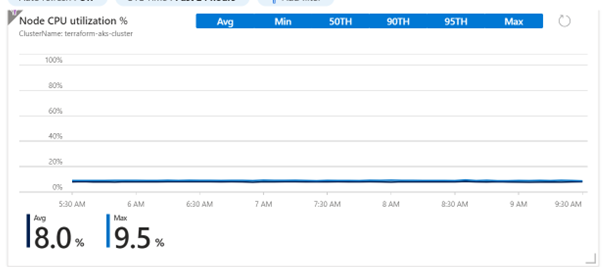
- **Average Pod Count**
This Chart is used to monitor the average pod count of the aks cluster. In the Chart, it shows there are currently 16 pods running in the whole aks cluster
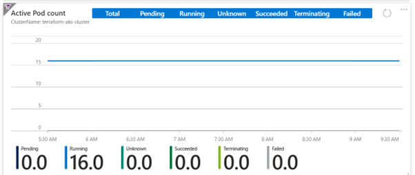
- **Average Disk Usage**
This Chart shows the average disk usage percentage for the nodes in the AKS cluster. It shows that currently, the disk usage is at 4.849%
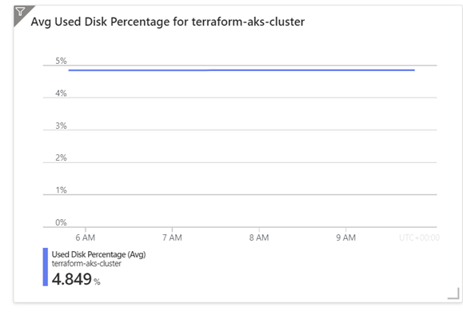
- **Bytes Read and Written Per Second**
This Chart is used to monitor both the bytes read and written per second. It shows that currently 3.39 bytes written per second and 18.46 kilobytes(18460 bytes) written per second
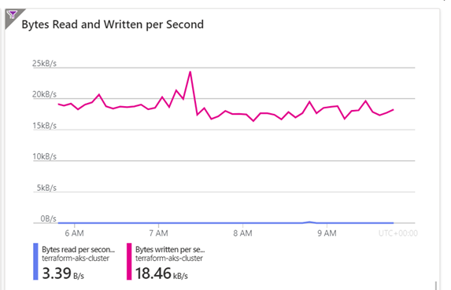

### Logs Analyzed through log analytics
- **Average Node CPU Usage Percentage Per Minute**: This logs the nodes average cpu usage per minute. 
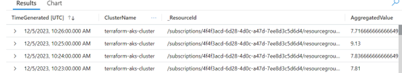
- **Average Node Memory Usage Percentage Per Minute**: This logs the nodes average memory usage per minute
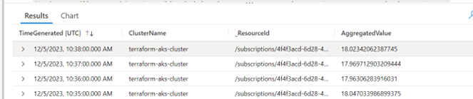
- **Pod Counts With Phase**: This logs records the counts of pods under different phases, such as pending, Running or Terminating. 
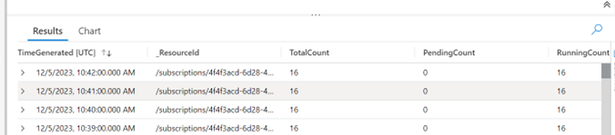
- **Find Warning Value in Container Logs**: This log is used to search for the value of "warning" in the log entries, which helps track potential issues or errors within the containers, and allows for troubleshooting
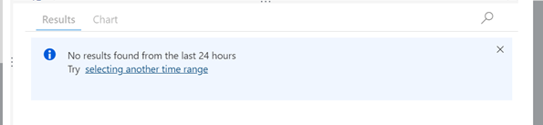
- **Monitoring Kubernetes Events**: This log allows for monitoring of kubernetes events such as pod schenduling, scaling events and errors. It allows the tracking of the health and stability of the cluster
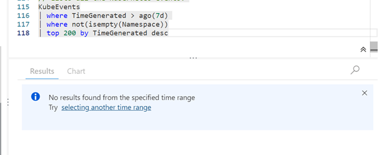

### Alerts configuration details
- The Alarm used is set to trigger when the disk usage percentage on nodes have reached more than 80%, indicitating the cpu is been heavily utilised, which affects the application performance. The alarm is set to check every 5 minuite with a lookback period of 15 minutes. The notification is set up to send to my email address.

- **Mitigation strategies when the alarm is triggered**
The first step is to check the metrics and the logs to find out the severity of the alarm triggered, to determine the actual disk usage percentage. For example, if the disk percentage is aroung 95% then that would require an immediate action. The specific action might include deploying additonal nodes in the cluster, running the pods and apps in the new clusters and spreading the traffic between the old and new nodes. The next step is to provide a clear documentation of each alert and the action taken to resolbve it. This will be valuable incase similar issues happens in the future. After documentation, it is important to conduct a post-incident review to understand the root cause of the issues and come up with ways to prevent that in the future

## Secrets Management and AKS Integration with Azure Key Valut
Azure Key Vault provides a robust solution for secure storage and management of sensitive information. This is where the webapp secrets, such as the database server, database name, username and password will be created in order to avoid hardcoding that into the app sourcecode itself. In this case, I created a key vault called kub-cluster-key-vault. The Vault URI allows other clents to access and interact with the resources stored in the key vault. I have assigned the **Key Vault Administrator** role to myself, which grants my user's full control over the key vault, including managing access policies, configuiring advanced settings and performing operations within the key vault. 
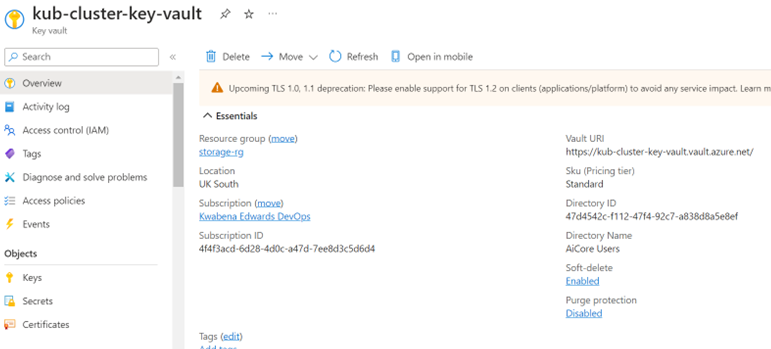 

### The information stored in the Key Vault 
- **Database Server**: This provides the unique url address to connect to the database server created for the app
- **Dataabse Name**: This is the name of the database created
- **Username**: This is the unique username for a user to login to the database
- **Password**: This is the password used to login into the database

### Steps to integrate AKS with Key Vault
- Since the cluster has already been created, run the following command to enable managed identity for the cluster. The resource group and name should be replaced with the cluster's resource group and the clusters name
```
az aks update --resource-group <resource-group> --name <aks-cluster-name> --enable-managed-identity
```
- Run the following to get information about the managed cluster created in order to assign a permission role to it. 
```
az aks show --resource-group <resource-group> --name <aks-cluster-name> --query identityProfile
``` 
- Use the following command to assign a "Key Valuts Secrets Officer" role to the managed Identity created earlier. Replace  managed-identity-client-id with the client id from the output earlier and the key vault resource group name and key vault name.
```
az role assignment create --role "Key Vault Secrets Officer" \
  --assignee <managed-identity-client-id> \
  --scope /subscriptions/{subscription-id}/resourceGroups/{resource-group}/providers/Microsoft.KeyVault/vaults/{key-vault-name}
```

### Modifications made to the application code
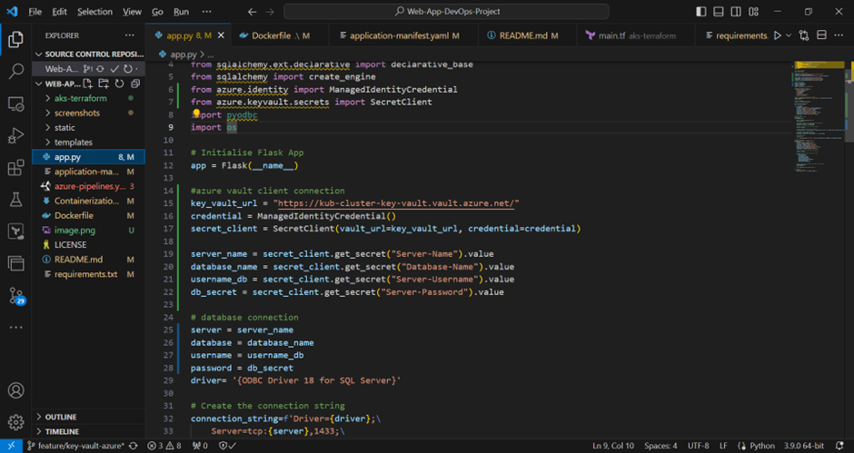
- The first step is install the azure-identity and azure-keyvaluts-secrets library using pip
```
pip install azure-identity
pip install azure-keyvault-secrets
```
- Import ManagedIdentityCredential from azure-indentity and SecretClient from  azure-keyvaluts-secrets
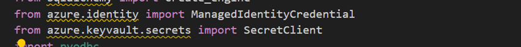
- Create secret client using the keyvault url and managedIdentityCredential
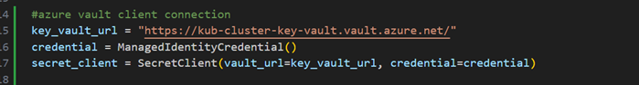
- Use the secret client to retrive the value of each of the secrets in the key vault and store it in their respective variables
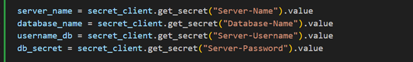
- Finally assign each of the secrets value to the correspnding database connection credential
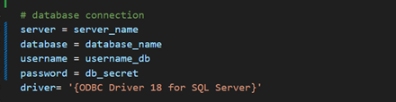


## DevOps Pipeline Architecture
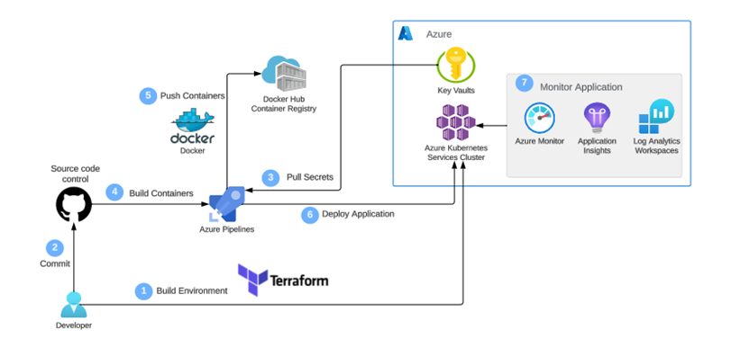
## Contributors 

- [Junior Edwards](https://github.com/junior451)

## License

This project is licensed under the MIT License. For more details, refer to the [LICENSE](LICENSE) file.
